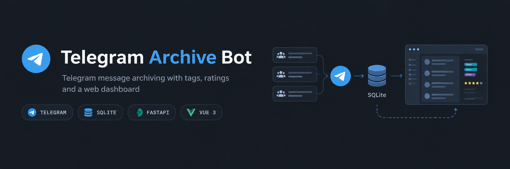
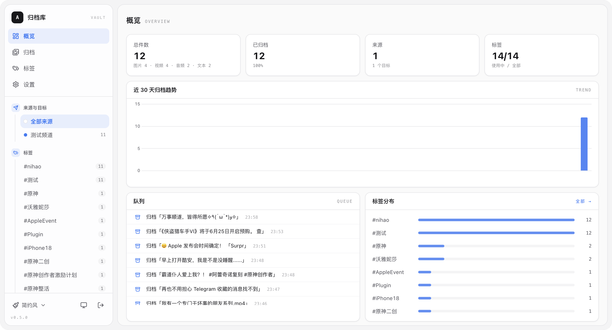
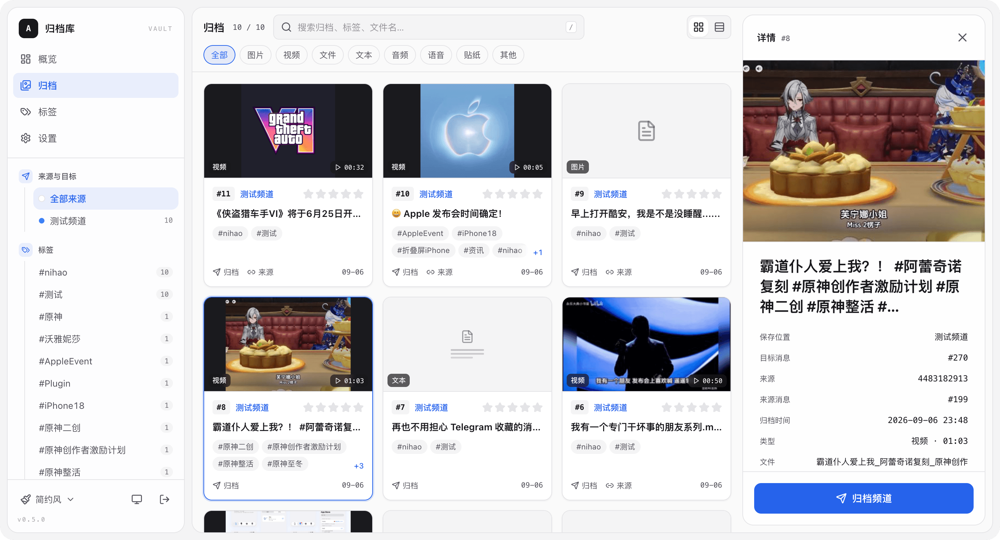
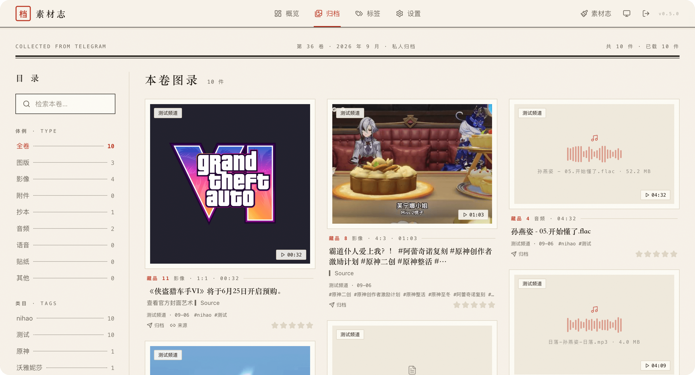
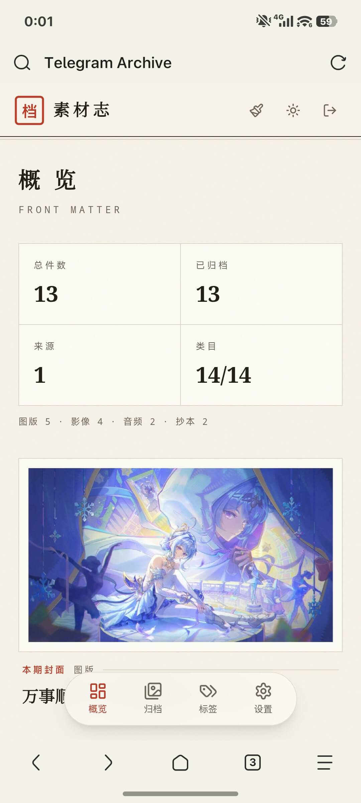
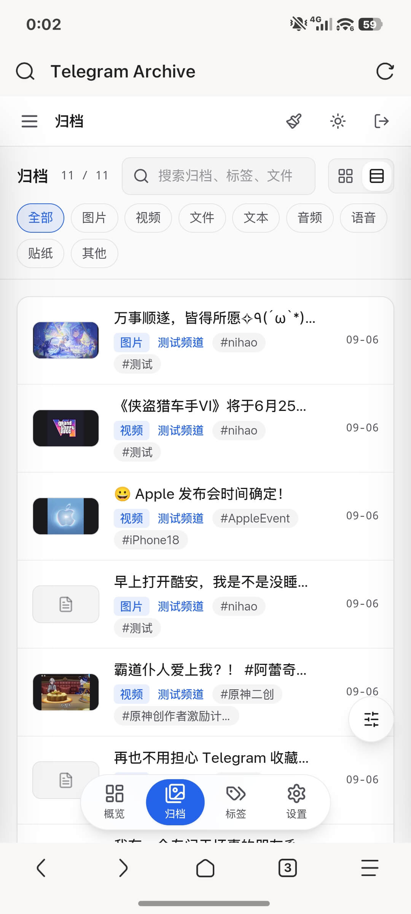

# Telegram Archive Bot



[](https://github.com/VenenoSix24/telegram-archive-bot/actions/workflows/ci.yml)


> [English](README.en.md) ｜ 简体中文

Telegram 消息归档工具。

监听指定的 Telegram 群/频道，将新消息复制到目标群/频道，并在 SQLite 中保存消息映射、Tag、评级、来源等信息。提供 Web 管理后台，可以搜索、筛选和编辑归档内容，修改后会同步到 Telegram。

媒体文件不会下载到服务器，归档消息使用 Telegram 的复制引用。服务器只保存数据库和用于 Web 预览的缩略图。

## Features

- 自动归档：监听源群/频道，通过队列复制消息到目标群/频道，支持限速、失败重试和重启恢复
- 多对多路由：支持多个源群/频道和多个目标群/频道，可为源群/频道设置默认 Tag 和独立目标
- Tag：结构化保存 Tag，并为每个目标群/频道维护置顶 Tag 索引
- 评级：支持 0～5 星，可显示在消息头并用于筛选
- 全文搜索：基于 SQLite FTS5，支持中英文关键词和多词搜索
- Web 管理后台：浏览、搜索、筛选、编辑、备份和导出
- 双向同步：Telegram 中编辑或删除归档消息后，数据库和 Web 后台会同步更新
- 消息模板：通过 `message_template` 自定义评级、Tag、正文和来源的顺序
- 自动备份：按间隔备份 SQLite 数据库，可选上传到指定 Telegram 会话
- 数据导出：支持导出全部数据或当前筛选结果为 CSV / JSON

## 界面预览

概览仪表盘（统计、近 30 天趋势、队列与近期处理记录）：



归档浏览与详情编辑（简约风），以及素材志主题的图录视图：

<table>
  <tr>
    <td width="50%" align="center"></td>
    <td width="50%" align="center"></td>
  </tr>
</table>

手机端（响应式布局）：

<table>
  <tr>
    <td width="50%" align="center"></td>
    <td width="50%" align="center"></td>
  </tr>
</table>


## 工作原理

```text
源群/频道 A ──┐
源群/频道 B ──┼─→ 监听 → SQLite → 队列 → 复制消息 → 目标群/频道
中转群/频道 ──┘             │
                       └──── Web (FastAPI + Vue 3)
                              │
                              └─ 搜索 / 编辑 → 写库 → 更新 Telegram
```

项目将 Telegram 和 SQLite 分开使用：

1. Telegram 负责保存媒体和展示归档消息。
2. SQLite 保存消息映射、Tag、评级、来源和处理状态。
3. 程序负责监听、排队、复制以及两端之间的同步。

## 快速开始

### 环境要求

- Python 3.11+
- 一个专用 Telegram 账号，建议使用小号
- Telegram API ID / API Hash，可从 [my.telegram.org](https://my.telegram.org/) 获取

### 安装

先获取代码（git clone 或在 Releases 页面下载源码包）：

```bash
git clone https://github.com/VenenoSix24/telegram-archive-bot.git
cd telegram-archive-bot
```

然后安装依赖：

```bash
python3 -m venv .venv
source .venv/bin/activate
pip install -r requirements.txt
```

### 配置

复制 `.env.example` 为 `.env`（凭据配置），复制 `config.example.yaml` 为 `config.yaml`（业务配置）：

```bash
cp .env.example .env
cp config.example.yaml config.yaml
```

编辑 `.env`：

```dotenv
TELEGRAM_API_ID=...
TELEGRAM_API_HASH=...
WEB_TOKEN=...
```

`WEB_TOKEN` 建议使用随机字符串，例如：

```bash
openssl rand -hex 32
```

`config.yaml` 有两种改法：手动编辑文件，或在 Web 后台的「设置」页面里改（保存后需重启程序生效）。需要填写：

- `source_chats`
- `target_channels`
- `admins`

### 登录

首次启动认证：

```bash
python -m app.auth
```

按照提示输入手机号、验证码和两步验证密码。认证完成后会生成 `telegram_archive.session`。

### 启动

```bash
python -m app
```

默认 Web 地址：

```text
http://127.0.0.1:8000
```

使用 `WEB_TOKEN` 登录后台。

如果不知道 Telegram 会话的 `chat_id`，把程序账号加入对应群组或频道，然后发送：

```text
/id
```

程序会返回当前会话的 chat ID 和你的用户 ID。

## Docker 部署

不想单独配置 Python 环境时，可以使用 Docker Compose：

先把 `.env.example` 复制为 `.env`、`config.example.yaml` 复制为 `config.yaml` 并填好内容，然后：

```bash
docker compose up -d --build
```

前端会在镜像构建阶段完成，不需要在服务器上安装 Node.js。

## 配置说明

凭据放在 `.env`，业务配置放在 `config.yaml`。除手动编辑文件外，Web 后台的「设置」页面也能修改大部分配置（保存后重启生效）。

完整字段可以参考 [config.example.yaml](https://github.com/VenenoSix24/telegram-archive-bot/blob/main/config.example.yaml)。

环境变量 `ARCHIVE_CONFIG` 可用于指定配置文件路径。

### `.env`

| 变量 | 必填 | 说明 |
| --- | --- | --- |
| `TELEGRAM_API_ID` / `TELEGRAM_API_HASH` | 是 | Telegram API 凭据 |
| `TELEGRAM_BOT_TOKEN` | 否 | 预留字段，当前版本使用个人账号登录 |
| `WEB_ENABLED` | 否 | 是否启用 Web，默认 `true` |
| `WEB_HOST` | 否 | Web 监听地址，默认 `127.0.0.1` |
| `WEB_PORT` | 否 | Web 端口，默认 `8000` |
| `WEB_TOKEN` | `WEB_ENABLED=true` 时必填 | Web 登录口令 |
| `LOG_LEVEL` | 否 | 日志级别：`DEBUG` / `INFO` / `WARNING`，默认 `INFO` |

### `config.yaml`

| 字段 | 说明 |
| --- | --- |
| `telegram.source_chats[]` | 源群列表，包含 `chat_id`、`name`、`default_tags`；可选 `target_channel_ids` 指定目标，`private` 控制是否自动补 `-100` 前缀 |
| `telegram.target_channels[]` | 目标频道列表，包含 `chat_id`、`name` |
| `forward.interval` | 消息发送间隔，默认 `3` 秒 |
| `forward.retry_count` | 最大重试次数，默认 `3` |
| `source.show_link` | 是否在归档消息中显示来源链接，默认 `true` |
| `tags.preserve_original` | 是否保留原消息中的 hashtag，默认 `true` |
| `rating.enabled` | 是否启用评级，默认 `true` |
| `thumbnails.media` | 相册缩略图来源：`first_video` / `first`，默认 `first_video` |
| `thumbnails.source` | 缩略图来源：`auto` / `archive` / `source`，默认 `auto` |
| `message_template` | 消息区块顺序，默认 `[rating, tags, body, source]`；`body` 必须保留 |
| `backup.enabled` | 是否启用自动备份，默认 `true` |
| `backup.interval_days` | 备份间隔：`1` / `3` / `7` / `30`，默认 `7` |
| `backup.retain` | 本地保留的备份数量，默认 `7` |
| `backup.upload_chat_id` | 可选，备份完成后将文件上传到指定 Telegram 会话 |
| `admins` | 管理员用户 ID 列表 |
| `database.path` | SQLite 数据库路径，默认 `archive.sqlite` |

## 消息格式

默认消息格式：

```text
推荐指数：⭐⭐⭐⭐⭐

#存档 #Archive #Nice

收藏的消息再也不乱啦！

来自：
https://t.me/xxx/123
```

Tag 使用空格分隔，并以结构化列表保存。

评级为 `0` 时表示清除评级，不会渲染到消息中。

## 管理命令

管理员用户可以在接入的 Telegram 会话中使用以下命令。

### 回复类命令

回复一条已归档消息后使用：

| 命令 | 说明 |
| --- | --- |
| `/tag <标签…>` | 给被回复的消息添加 Tag |
| `/rating <0-5>` | 设置评级，`0` 清除评级 |

### 直接发送的命令

这些命令直接发送即可：

| 命令 | 说明 |
| --- | --- |
| `/status` | 查看监听、目标、队列和 Worker 状态 |
| `/queue` | 查看队列状态，包括等待、失败和预计剩余 |
| `/tags` | 查看 Tag 统计 |
| `/pause` / `/resume` | 暂停 / 恢复队列 |
| `/rethumb [N]` | 重新抓取最近 N 条消息的缩略图，默认 `100` |
| `/id` | 查看当前会话 ID |
| `/start` / `/help` | 查看命令列表 |

## Web 后台

Telegram 归档管道和 Web 后台运行在同一个进程中：

- **仪表盘**：查看归档统计、近 30 天趋势、队列状态和处理记录
- **归档**：按关键词、Tag、评级、媒体类型和来源筛选；编辑评级和 Tag 后自动同步 Telegram
- **Tags**：查看 Tag 使用情况
- **设置**：编辑配置、备份和恢复数据库、导入数据、重置数据库、查看失败记录、导出 CSV / JSON
- **主题**：提供简约风和素材志两套界面，支持浅色、深色和跟随系统

默认只监听 `127.0.0.1:8000`。

需要局域网访问时：

```dotenv
WEB_HOST=0.0.0.0
```

然后通过：

```text
http://<局域网IP>:8000
```

访问。

如果部署到公网，建议使用 Nginx 或 Caddy 反向代理，并启用 HTTPS。

### 健康检查

提供无需鉴权的：

```text
GET /health
```

用于检查数据库状态和后台任务状态，也可以用于 Docker `HEALTHCHECK` 或反向代理探活。

### 本地调试 Web

只调试 Web、不连接 Telegram 时：

```bash
python -m app.web.devserver
```

编辑类接口会返回 `503`。

## 数据与备份

| 路径 | 说明 |
| --- | --- |
| `telegram_archive.session` | Telegram 登录状态，迁移服务器时需要一并备份 |
| `archive.sqlite` | SQLite 数据库，包含全部结构化数据 |
| `logs/` | 日志目录 |
| `thumbs/` | 缩略图缓存，可使用 `/rethumb` 重建 |

数据库 schema 由 `migrations/` 下的 SQL 迁移文件管理，程序启动时会自动应用迁移。

## 开发

### 后端

Python 3.11+：

```bash
pip install -r requirements-dev.txt

ruff check app tests
pytest
```

### 前端

前端位于 `web/`，使用 pnpm + Node 22：

```bash
cd web

pnpm install --frozen-lockfile
pnpm dev
pnpm test
pnpm lint
pnpm build
```

开发服务器默认运行在 `:5173`，`/api` 会代理到 `127.0.0.1:8000`。

### CI

GitHub Actions 会执行：

- Backend: `ruff check` + `pytest`
- Frontend: `pnpm lint` + `pnpm test` + `pnpm build`
- Docker: 构建镜像检查 Dockerfile

## 项目结构

```text
app/
├── processor/        # Telegram 事件处理
├── queue/            # 发送队列、限速、重试和恢复
├── renderer/         # 归档消息渲染
├── tags/             # Tag 和置顶索引
├── telegram/         # Telethon 客户端和消息复制
├── media/            # 缩略图和补抓
└── web/              # FastAPI、鉴权、配置、备份和导出

migrations/           # SQLite 数据库迁移
web/                  # Vue 3 + Tailwind 前端
tests/                # pytest 测试
```

## FAQ

### 这是 Bot API 机器人吗？

不是。

项目使用 Telethon 以个人账号登录运行，`TELEGRAM_BOT_TOKEN` 目前只是预留字段。

建议使用专用小号，并将其设置为目标频道管理员。

### 媒体会下载到服务器吗？

不会。

归档消息使用 Telegram 的复制引用，媒体文件仍然保存在 Telegram。服务器只保存 Web 预览所需的缩略图。

### 在 Web 后台修改 Tag 或评级后，Telegram 中的消息会更新吗？

会。

Web 保存后会更新数据库，并重新渲染对应的 Telegram 消息和 Tag 索引。

反过来，如果直接在 Telegram 中编辑或删除归档消息，数据库和 Web 后台也会跟随更新。

### 修改 `config.yaml` 后为什么没有生效？

通过 Web 后台修改配置后需要重启进程。

保存配置时会自动生成 `config.yaml.bak`。

`message_template` 等消息渲染配置只影响之后新归档的消息。

### 队列处理到一半进程退出了怎么办？

启动时会检查队列，将中断的 `processing` 任务恢复为 `pending`，然后继续处理。

### 忘记 Web 登录口令怎么办？

修改 `.env` 中的 `WEB_TOKEN`，然后重启程序即可。

浏览器会话会在进程重启后失效，需要重新登录。

## License

[MIT](LICENSE) © 2026 VenenoSix24
